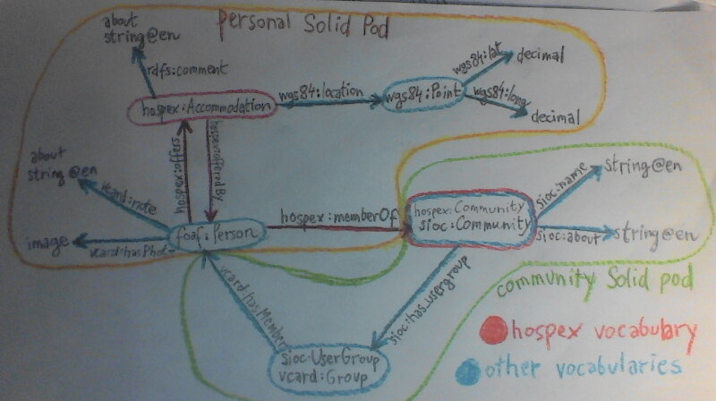

# Inrupt Developer Workshop Submission

## Description

An app is worth a thousand words!

Go to https://sleepy.bike :heart:

### Definitions

- **hospitality exchange (hospex) community**: A community of people who want to offer each other (free) accommodation, meet in reality, and more.
- **offer**: Accommodation that one member of a hospex community (host) offers to others (guests).

### Motivation

Members of hospitality exchange communities have a problem. Once, they joined a hospitality exchange network. They enjoyed interactions with other members in real world and had a jolly good time. It was a cozy community, run by volunteers. A community with it's unique spirit, built on trust and openness.

But then something happened. Mindset of the people in control changed. Suddenly, the access to the community got hidden behind a paywall. Directors started disowning the volunteers and their work. Things got rather grim.

> Saemy wrote about the bicycle touring community WarmShowers:
>
> WarmShowers used to be open and inviting. Discussions were held in public, feedback and questions were handled in a publicly visible forum, membership was possible for everyone and free.
>
> Unfortunately, a lot of that changed in the past years: Decisions are now made by a board that is hardly reachable and does not give insights to their decision process, critics are not welcome, membership is only available to the ones that can afford it, apps became highly priced and source code was made private, ...

So the members flocked to another platform. And then another. Some ended up with 5 accounts for 5 different communities. And although a single user can relatively easily move from one platform to another, the community, as a whole, remains trapped.

Finally, out of grief of [former WarmShowers android app volunteer developers](https://warmshowers.bike/), the [Open Hospitality Network](https://openhospitality.network) was born. And now we're trying to decentralize and federate hospitality exchange - to solve the issue of centralized boards ending up with too much power and locking their own communities in a platform the members cannot influence or move away from - once forever.

And here we are, implementing hospitality exchange with [Solid](https://solidproject.org).

_image above: We've showcased the app to some of the people of OHN last Monday. Workshop participants (Mariha and Michal) are in the last row._

## Features

When a user uses the app for the first time, a document at `https://mysolidpod/public/hospex.ttl` is created, where all their relevant data will be stored.

### Implemented features: What the app can currently do

First, [sign in](https://sleepy.bike).
After a first successful authentication, you'll be prompted to _get started_.
Then, you'll be walked through necessary steps to use the app to its full potential.

#### Join a hospex community

At https://sleepy.bike/communities, you can see a list of available communities and join communities that you like.

All of your data are stored on your solid pod. The community only contains a list of community members' webIds, which only members can access. In the future we'll also need (semi-)centralized indexes to allow discovery of people by their location.

_Here comes the power of Solid._ You can use a single account to access many communities. And when one of your communities goes corrupt, you can move to another and keep your account and all of your data. Because you own it.

#### See your or other people's profile

At https://sleepy.bike/users/[webId], you can see your profile, and a profile of other hospex community members.

#### Create, update and delete a hosting offer

At https://sleepy.bike/offers, you can offer accommodation to others, and manage it.

#### See other offers on a map

At https://sleepy.bike, you can see a map with all users who belong to your communities. When you travel, here you can find places to stay and people to meet.

### Still not implemented: Plans for the future

#### Edit your profile

- add a description, contact information, your interests, ...

#### Send messages to other members

- maybe this is necessary, maybe not

#### Post your travel plans...

- ...and members of various communities (even those you can't see) from the area will be notified, and can invite you
- We'd like to implement this feature with ActivityPub, and make it interoperable with existing non-solid communities, so users can reach many others.

#### Connect to others

- **Create connections** with people you know `:me foaf:knows myFriend: .`
- **Write a reference**, to tell others about your experience with a particular member (social proof of safety)

#### Share your hosting offers in a more granular way

- offer your garden to a community of hikers and your princess bed to [glouchsurfers](https://hauteliving.com/2015/04/glouchsurfing-a-luxurious-alternative-to-couchsurfing/560864/)

#### Scale

The current architecture doesn't work for large numbers of members. We can't fetch everybody's profile. We need an index which will allow easy discovery of people by their location.

#### Create and manage a community

- Currently we're creating communities manually :tired_face: 

#### Customize the app to the needs of different communities

## How we built it

It's been a journey... :bicyclist: 

We have
- figured out the minimal application architecture
- met in reality :fallen_leaf: 
- struggled with Solid limits, especially related to permissions (we need them tight) and solid server implementations incompatibility
- asked many questions at [Solid project forum](https://forum.solidproject.org/u/mrkvon/activity) and workshop slack
- created a [hospex vocabulary](http://w3id.org/hospex/ns#) and even got a namespace for it at [w3id.org](https://github.com/perma-id/w3id.org/pull/2397)
- we [built the app](https://sleepy.bike)
- last but not least, we've learned a lot of new stuff about Solid and how it can be used to build social networks based on groups and communities!

### Data model

#### Vocabularies we used

- [hospex](http://w3id.org/hospex/ns#) - Hospitality Exchange vocabulary we created as part of this workshop
- [sioc](http://rdfs.org/sioc/ns#)
- [vcard](http://www.w3.org/2006/vcard/ns#)
- [wgs84](http://www.w3.org/2003/01/geo/wgs84_pos#)
- rdfs, foaf - little

### Data flow

1. When User signs in for the first time, they're prompted to get started. At that point, a hospex document at `https://theirsolidpod/public/hospex.ttl` is created.
2. When User signs in, a list of all user's communities, along with a list of curated communities is downloaded. The data include community's
    - name
    - description, and
    - (when user has sufficient permissions) a list of members
    
    All these community data are stored at community solid pod.
3. Data of all found members are downloaded. That is
    - name
    - profile picture
    - offers
        - location
        - description
    - uris of communities user is member of
    
    All these data are stored at personal solid pods
4. Data of all newly found communities get dowloaded (e.g. communities of found users that aren't curated or user is not member of)
5. And back to step 2-5 until we can't find anything new
6. When a user joins a community, the triple `vcard:Group vcard:hasMember :me.` gets appended to the list of community members. Now that they're a member, they have a permission to read the list of other community members. So the list gets fetched and steps 2-5 are repeated with this newly joined community and its members

### What we learned

We figured out how to implement social networks over Solid.

We chose the approach of groups/communities, because it is most natural for hospitality exchange. That means, people find each other by joining communities.

We wanted to have the communities secure, so only their members would see the list of other community members. We learned [how to use acl:AgentGroup](http://solid.github.io/web-access-control-spec/#acl-agentgroup) for that purpose.

We also wanted to limit who can see a person's hospex data, to other community members only. [We didn't succeed at that](https://forum.solidproject.org/t/can-i-use-a-non-public-group-to-define-access-to-my-resources/4841), and personal hospex data is public at the moment. This issue should get resolved before going to production!

We wrote [a vocabulary](../src/vocabularies/hospex.ttl) following [solidproject tutorial](https://solidproject.org/developers/vocabularies), and got a namespace for it at [w3id.org](https://github.com/perma-id/w3id.org/pull/2397)!

### Limitations we hit

#### Incompatibility of Solid Servers

The app consistently works only with Node Solid Server.

(todo)

#### Permission limits

(todo)

## Tech Stack

### Generic
- [Typescript](https://www.typescriptlang.org) - takes care of many headaches that JavaScript doesn't, so development is much more fun
- [React](https://reactjs.org) - the most popular Javascript frontend framework
- [Redux](https://redux.js.org) - for application state management
- [Tailwind.css](https://tailwindcss.com) - css framework that we tried out for the first time

### Inrupt tools

- [@inrupt/solid-client-authn-browser](https://npmjs.com/@inrupt/solid-client-authn-browser) - to sign in and out with Solid identity
- [@inrupt/solid-client](https://npmjs.com/@inrupt/solid-client) - to manage data on Solid pods
- [@inrupt/artifact-generator](https://npmjs.com/@inrupt/artifact-generator) - we've created a [hospex vocabulary](http://w3id.org/hospex#ns), and with this library, we've [made it easy to use](https://github.com/OpenHospitalityNetwork/ohn-solid/blob/main/src/vocabularies/HOSPEX.js). We've also used it to create [artifacts](https://github.com/OpenHospitalityNetwork/ohn-solid/blob/main/src/vocabularies/GEO.js) for [wgs84_pos](http://www.w3.org/2003/01/geo/wgs84_pos#), which we haven't found in [rdf-namespaces](https://www.npmjs.com/rdf-namespaces) and similar

## Demonstration Video

[Demonstration video on YouTube](https://youtu.be/TZCe76OiLFs)

## Industry

:tada: _other_ :tada:

We've created a Social Network, which helps people to meet each other in reality, and offer hospitality to each other.

_other_ therefore means:

- Hospitality
- Community
- Social Networks

## Repository

[OpenHospitalityNetwork/ohn-solid](https://github.com/OpenHospitalityNetwork/ohn-solid)

### License

[MIT](../LICENSE) - https://opensource.org/licenses/MIT
